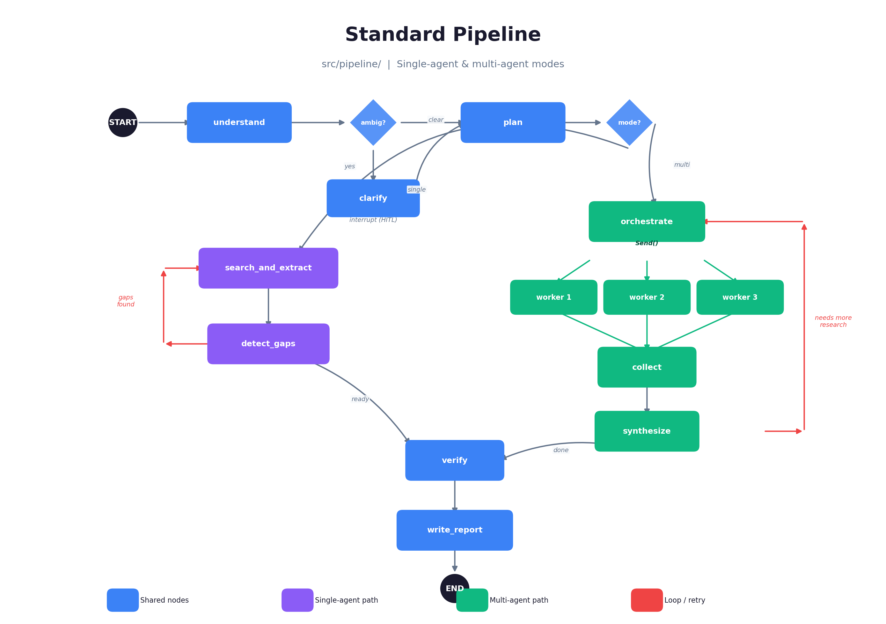
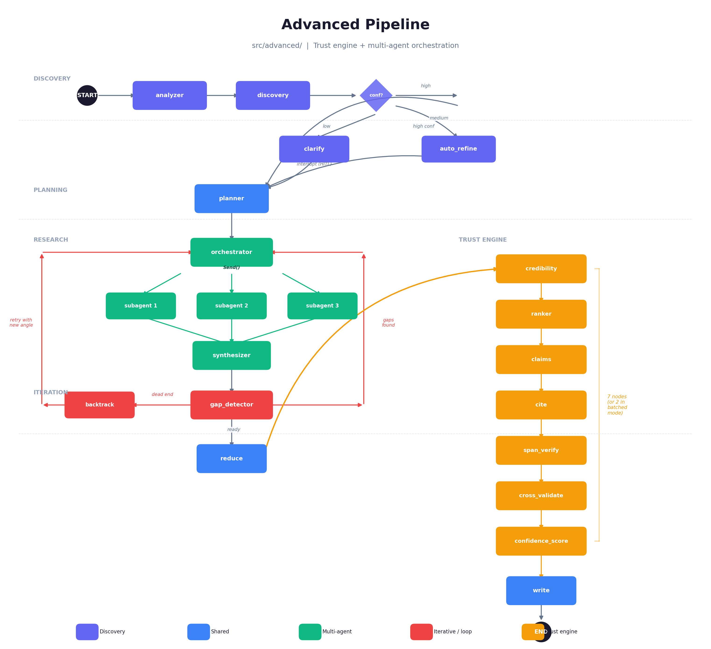

# Research Studio

A deep research agent built on [LangGraph](https://langchain-ai.github.io/langgraph/). Give it a question, it searches the web, reads pages, extracts facts, verifies them, and writes a grounded report with inline citations.

There are two pipelines:

- **Standard pipeline** (`src/pipeline/`) -- a clean, self-contained research graph with single-agent and multi-agent modes. Handles most queries well and is the easiest to understand and extend.
- **Advanced pipeline** (`src/advanced/`) -- adds a trust engine on top: source credibility scoring, claim extraction, span-level verification, cross-validation, and per-claim confidence indicators. More rigorous, but slower and more expensive.

Both pipelines are registered in `langgraph.json` and work out of the box with [LangGraph Studio](https://github.com/langchain-ai/langgraph-studio).

## How it works

### Standard pipeline

The standard pipeline supports two research modes, chosen at runtime:

- **Single-agent**: iterative search loop with gap detection. Searches, extracts facts, checks what's missing, searches again until coverage is good enough or the iteration cap is hit.
- **Multi-agent**: breaks the query into independent sub-questions, fans out parallel workers via LangGraph's `Send()`, collects and synthesizes results, then writes.



### Advanced pipeline

The advanced pipeline follows the same core flow but adds a trust engine between extraction and writing -- 7 specialized nodes (or 2 in batched mode) that score source credibility, extract claims, map citations, verify spans against source text, cross-validate across sources, and assign per-claim confidence scores.



## Setup

### 1. Clone and install

```bash
git clone <your-repo-url>
cd research-studio
pip install -e ".[extract]"
```

The `[extract]` extra pulls in `trafilatura` and `beautifulsoup4` for better HTML text extraction. The agent works without them (falls back to regex), but results are noticeably better with them.

### 2. Environment variables

```bash
cp .env.example .env
```

Fill in:

| Variable | Required | What it's for |
|----------|----------|---------------|
| `OPENAI_API_KEY` | Yes | LLM calls (GPT-4o, GPT-4o-mini) |
| `TAVILY_API_KEY` | Yes | Web search |
| `LANGCHAIN_TRACING_V2` | No | Set to `true` for LangSmith tracing |
| `LANGCHAIN_API_KEY` | No | Required if tracing is enabled |

### 3. Run

**Standard pipeline** (recommended starting point):

```bash
# Multi-agent mode (default) -- parallel workers research sub-questions
python -m src.run "What is quantum computing?"

# Single-agent mode -- iterative search with gap detection
python -m src.run --single-agent "Compare React vs Vue"

# Compare both modes side-by-side
python -m src.run --compare "Latest AI developments"
```

**Advanced pipeline** (trust engine -- slower but more rigorous):

```bash
python -m src.run_advanced_trust_engine "Who is Satya Nadella?"
python -m src.run_advanced_trust_engine --single-agent "Compare Python vs JavaScript"
```

### 4. LangGraph Studio

Both graphs are registered in `langgraph.json`:

```bash
langgraph dev
```

This opens two graphs in Studio:
- `pipeline` -- the standard research graph
- `advanced` -- the trust engine graph

You can interact with either graph visually, inspect state at each node, and use the configuration knobs (model selection, report format, etc.) directly from the Studio UI.

## CLI options

| Flag | Default | Description |
|------|---------|-------------|
| `--single-agent` | off | Use iterative single-agent mode instead of multi-agent |
| `--compare` | off | Run both modes and show side-by-side comparison |
| `--model` | `gpt-4o` | Main LLM for planning, synthesis, and writing |
| `--fast-model` | `gpt-4o-mini` | Fast LLM for bulk extraction |
| `--max-results` | `5` | Tavily results per search query |
| `--format` | `detailed` | Report format: `detailed`, `concise`, or `bullet_points` |
| `--system-prompt` | none | Custom instructions prepended to the report writer |
| `--iterations` | `5` / `2` | Max search loop iterations (single / multi) |
| `--output` | none | Save the report to a file |

Examples:

```bash
# Bullet-point summary with fewer search results
python -m src.run --format bullet_points --max-results 3 "What is quantum computing?"

# Custom writing instructions
python -m src.run --system-prompt "Write for a technical audience" "Rust vs Go"

# Save output
python -m src.run --output report.md "Explain CRISPR"
```

## Project structure

```
research-studio/
├── src/
│   ├── run.py                          # CLI entry point (standard pipeline)
│   ├── run_advanced_trust_engine.py    # CLI entry point (advanced pipeline)
│   ├── pipeline/                       # Standard pipeline
│   │   ├── state.py                    #   ResearchState (extends MessagesState)
│   │   ├── prompts.py                  #   All LLM prompts
│   │   ├── nodes.py                    #   Node functions (11 nodes)
│   │   └── graph.py                    #   Graph builder, routing, compiled graph
│   ├── advanced/                       # Advanced pipeline
│   │   ├── config.py                   #   ResearchConfig (frozen dataclass, ~50 tunables)
│   │   ├── state.py                    #   AgentState (extends MessagesState, ~60 fields)
│   │   ├── graph.py                    #   Multiple graph variants
│   │   └── nodes/                      #   13 node modules
│   │       ├── discovery.py            #     Entity detection, query classification
│   │       ├── planner.py              #     Research planning
│   │       ├── search_worker.py        #     Web search + extraction
│   │       ├── orchestrator.py         #     Multi-agent orchestration
│   │       ├── claims.py               #     Claim extraction
│   │       ├── cite.py                 #     Citation mapping
│   │       ├── ranker.py               #     Source credibility scoring
│   │       ├── trust_engine.py         #     Full trust pipeline (7 nodes)
│   │       ├── trust_engine_batched.py #     Batched trust pipeline (2 LLM calls)
│   │       ├── iterative.py            #     Gap detection, dead-end backtracking
│   │       ├── reducer.py              #     Result collection
│   │       └── writer.py              #     Report generation
│   ├── tools/                          # Tavily search, HTTP fetch
│   └── utils/                          # LLM wrappers, caching, JSON parsing, scoring
├── tests/
│   ├── eval_cases.py                   # Test case definitions
│   ├── conftest.py                     # Pipeline runner, mock state builder, snapshots
│   ├── run_eval.py                     # Main eval runner
│   ├── evaluators/
│   │   ├── structural.py              # 10 deterministic checks
│   │   ├── llm_judge.py               # 5 LLM-as-judge evaluators
│   │   └── behavioral.py             # 7 behavioral tests
│   ├── test_structural.py             # pytest wrapper for structural checks
│   ├── test_llm_judge.py              # pytest wrapper for LLM judge
│   └── test_behavioral.py            # pytest wrapper for behavioral tests
├── langgraph.json                      # LangGraph Studio configuration
├── pyproject.toml                      # Dependencies and project metadata
├── requirements.txt                    # Pinned dependencies
├── DESIGN.md                           # Detailed design document
└── .env.example                        # Environment variable template
```

## Evaluation suite

The project includes a 3-layer evaluation framework:

**Structural checks** (no API calls needed): report length, citation format, evidence count, source coverage, JSON schema validation, and more. 10 deterministic checks that run instantly.

**LLM-as-judge** (requires API calls): uses a strong model to assess relevance, groundedness, completeness, quality, and citation faithfulness. Each evaluator uses Pydantic structured output for reliable scoring.

**Behavioral tests**: state consistency, verified claims ratio, ambiguity detection accuracy, and more. Tests both offline (mock state) and online (live pipeline) scenarios.

```bash
# Quick offline run (mock states, structural only)
python -m tests.run_eval --offline

# Full run against live pipeline
python -m tests.run_eval --live

# Run specific cases
python -m tests.run_eval --live --cases factual_simple broad_comparison

# Skip expensive LLM judge
python -m tests.run_eval --live --skip-llm-judge

# Save results
python -m tests.run_eval --live --output results.json
```

## LangGraph features used

This project uses several LangGraph features beyond basic graph construction:

- **`MessagesState`** inheritance for chat-compatible state
- **`operator.add`** reducers for safe parallel state accumulation
- **`Send()`** for dynamic fan-out to parallel workers
- **`interrupt_before`** + `MemorySaver` for human-in-the-loop query clarification
- **Conditional edges** for routing (single vs multi-agent, gap detection loops, dead-end backtracking)
- **Graph cycles** for iterative refinement (search -> extract -> check gaps -> search again)
- **`RunnableConfig["configurable"]`** with `context_schema` for LangGraph Studio knobs
- **Multiple compiled graph variants** from the same node functions

See [DESIGN.md](./DESIGN.md) for a detailed walkthrough of every node, edge, and design decision.

## License

MIT
