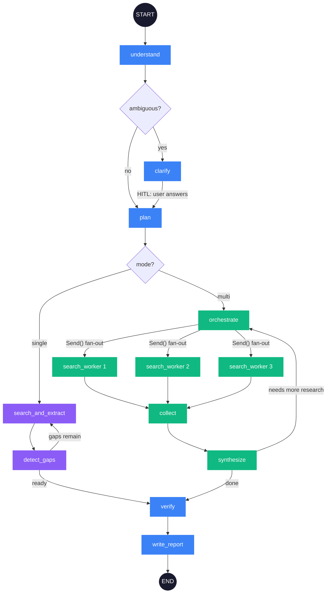
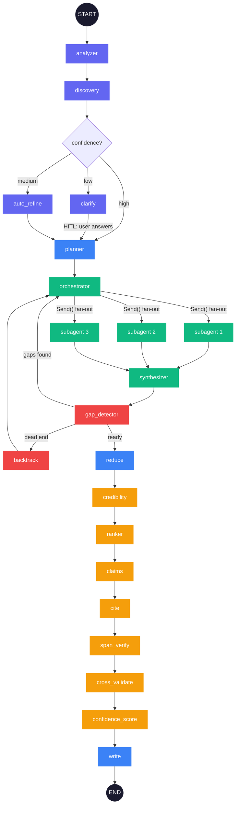

# Research Studio

Deep research agent built on [LangGraph](https://langchain-ai.github.io/langgraph/). You give it a question, it searches the web, reads pages, pulls out facts, checks them, and writes a report with citations.

Two pipelines:

- **Standard** (`src/pipeline/`) -- clean research graph. Single-agent (iterative search loop) or multi-agent (parallel workers via `Send()`). Handles most queries fine.
- **Advanced** (`src/advanced/`) -- same core flow + a trust engine on top. Source credibility scoring, span verification, cross-validation, per-claim confidence. Slower but catches things the standard pipeline doesn't.

Both work in [LangGraph Studio](https://github.com/langchain-ai/langgraph-studio) out of the box.

## How it works

### Standard pipeline

Two modes, chosen at runtime:

- **Single-agent** -- searches, extracts facts, checks what's missing, searches again. Loops until coverage is good enough or iteration cap is hit.
- **Multi-agent** -- breaks the query into sub-questions, fans out parallel workers, collects and synthesizes, then writes.



### Advanced pipeline

Same research flow but adds a trust engine between extraction and writing -- 7 nodes (or 2 in batched mode) that score source credibility, extract claims, verify spans against source text, cross-validate, and assign per-claim confidence.



## Setup

### 1. Install

```bash
git clone <your-repo-url>
cd research-studio
pip install -e ".[extract]"
```

`[extract]` pulls in `trafilatura` and `beautifulsoup4` for better HTML parsing. Works without them (falls back to regex) but results are better with them.

### 2. Environment

```bash
cp .env.example .env
```

You need:
- `OPENAI_API_KEY` -- for LLM calls (GPT-4o, GPT-4o-mini)
- `TAVILY_API_KEY` -- for web search

Optional: `LANGCHAIN_TRACING_V2=true` + `LANGCHAIN_API_KEY` if you want LangSmith tracing.

### 3. Run

**Standard pipeline** (start here):

```bash
# Multi-agent (default)
python -m src.run "What is quantum computing?"

# Single-agent with gap detection
python -m src.run --single-agent "Compare React vs Vue"

# Compare both modes side-by-side
python -m src.run --compare "Latest AI developments"
```

**Advanced pipeline** (trust engine):

```bash
python -m src.run_advanced_trust_engine "Who is Satya Nadella?"
python -m src.run_advanced_trust_engine --single-agent "Compare Python vs JavaScript"
```

### 4. LangGraph Studio

```bash
langgraph dev
```

Opens two graphs: `pipeline` (standard) and `advanced` (trust engine). You can inspect state at each node, play with config knobs, etc.

## CLI flags

| Flag | Default | What it does |
|------|---------|-------------|
| `--single-agent` | off | Iterative single-agent instead of multi-agent |
| `--compare` | off | Run both modes, show side-by-side |
| `--model` | `gpt-4o` | Main LLM |
| `--fast-model` | `gpt-4o-mini` | Fast LLM for extraction |
| `--max-results` | `5` | Tavily results per query |
| `--format` | `detailed` | `detailed`, `concise`, or `bullet_points` |
| `--system-prompt` | none | Custom instructions for the writer |
| `--iterations` | `5`/`2` | Max loop iterations |
| `--output` | none | Save report to file |

```bash
# Bullet points, fewer results
python -m src.run --format bullet_points --max-results 3 "What is quantum computing?"

# Custom writing style
python -m src.run --system-prompt "Write for a technical audience" "Rust vs Go"

# Save to file
python -m src.run --output report.md "Explain CRISPR"
```

## Project structure

```
research-studio/
├── src/
│   ├── run.py                       # CLI (standard pipeline)
│   ├── run_advanced_trust_engine.py  # CLI (advanced pipeline)
│   ├── pipeline/                     # Standard -- state, prompts, 11 nodes, graph
│   ├── advanced/                     # Advanced -- config, state, graph, 13 node modules
│   ├── tools/                        # Tavily search, HTTP fetch
│   └── utils/                        # LLM wrappers, caching, JSON parsing
├── tests/
│   ├── evaluators/                   # structural (10), llm_judge (5), behavioral (7)
│   ├── eval_cases.py                 # Test case definitions
│   ├── conftest.py                   # Pipeline runner, mock state, snapshots
│   ├── run_eval.py                   # Main eval runner
│   └── test_*.py                     # pytest wrappers
├── langgraph.json                    # LangGraph Studio config
├── pyproject.toml
├── requirements.txt
└── DESIGN.md                         # Detailed design doc
```

## Evals

Three layers, no LangSmith dependency:

**Structural** (instant, no API calls) -- 10 checks: report structure, citations map to real sources, evidence populated, metadata complete, etc.

**LLM-as-judge** (needs API calls) -- 5 evaluators with Pydantic structured output: relevance, groundedness (claim-level), completeness, quality (5 sub-scores), citation faithfulness.

**Behavioral** -- 7 tests that check the architecture works: config actually changes output format, gap loop improves coverage, both modes produce valid reports, ambiguous queries get caught, etc.

```bash
# Quick offline (mock states, structural only)
python -m tests.run_eval --offline

# Full live run
python -m tests.run_eval --live

# Specific cases, skip expensive LLM judge
python -m tests.run_eval --live --cases factual_simple --skip-llm-judge

# Save results
python -m tests.run_eval --live --output results.json
```

## LangGraph features

- `MessagesState` inheritance for chat-compatible state
- `operator.add` reducers for parallel-safe accumulation
- `Send()` for dynamic fan-out to workers
- `interrupt_before` + `MemorySaver` for human-in-the-loop
- Conditional edges for all routing (5 in standard, 10+ in advanced)
- Graph cycles for iterative refinement loops
- `RunnableConfig["configurable"]` with `context_schema` for Studio knobs

See [DESIGN.md](./DESIGN.md) for the full walkthrough.

## License

MIT
